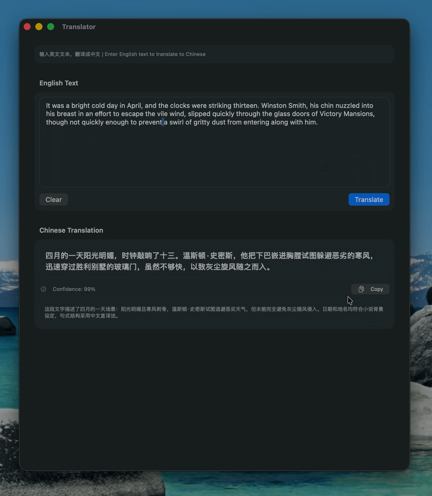

# FoundationModelsTranslator 

[](https://twitter.com/FradSer) [](https://developer.apple.com/documentation/foundationmodels/) [](LICENSE)

**English | [中文](README.zh-CN.md)**

A native macOS app for English to Chinese translation powered by Apple's FoundationModels framework with modern SwiftUI interface.



## Features

- **Real-time Streaming Translation**: Watch translations generate in real-time using FoundationModels streaming API
- **Custom Adapter Integration**: Specialized English to Chinese translation adapter trained on web search content
- **Confidence Scoring**: AI-powered confidence ratings for translation quality assessment
- **Cultural Context**: Contextual notes explaining cultural adaptations and nuances
- **Native macOS Interface**: Modern SwiftUI design with Liquid Glass elements optimized for macOS
- **Smart Copy Features**: One-click copying with clipboard integration for both platforms
- **Simplified Experience**: Focused translation interface without history management complexity

## Requirements

- **macOS 26+** (Tahoe) - Required for FoundationModels framework
- **Xcode 26.0.1+** - Latest development tools with AI integration
- **Swift 6.2+** - Enhanced Swift with advanced concurrency support
- **FoundationModels framework** - Apple's on-device AI framework
- **Note**: macOS 26 Tahoe is the final version supporting Intel processors

## Architecture

The app follows clean architecture principles with clear separation of concerns:

### Core Components

- **Translation Models** (`Translation.swift`)
  - `TranslationRequest`: Input data structure
  - `TranslationResult`: Output with confidence and notes

- **Translation Manager** (`TranslationManager.swift`)
  - Manages FoundationModels session
  - Handles adapter loading and fallback
  - Provides streaming translation support
  - Error handling and state management

- **UI Components**
  - `ContentView`: Main translation interface
  - `GlassDesign`: Custom glass morphism design system
  - Real-time progress indication
  - Cross-platform clipboard support

### Custom Translation Adapter

The app includes a specialized LoRA adapter (`translation_en_zh_CN.fmadapter`) trained using **[Apple's Foundation Models Adapter Training Toolkit](https://developer.apple.com/apple-intelligence/foundation-models-adapter/)** specifically for English to Chinese translation:

#### Training Methodology
- **Apple Official Toolkit**: Trained using Apple's Foundation Models Adapter Training Toolkit for on-device language model specialization
- **Parameter-Efficient Fine-Tuning**: Uses LoRA (Low-Rank Adaptation) technique with frozen base model weights
- **On-Device Optimization**: Specifically designed for Apple Silicon with memory-efficient training workflows

#### Model Architecture
- **Base Model**: DeepSeek-R1 Distilled optimized for translation tasks
- **LoRA Rank**: 32 for efficient fine-tuning (~160MB storage)
- **Speculative Decoding**: 5 draft tokens for enhanced inference speed
- **Domain Specialization**: Optimized for web search content translation scenarios
- **Fallback Support**: Graceful degradation to base model if adapter fails

#### Training Dataset (100K Samples)
The adapter was trained using a multi-dataset approach combining high-quality translation pairs:

**Primary Dataset** (39K samples - 100% retention):
- `FradSer/DeepSeek-R1-Distilled-Translate-en-zh_CN-39k-Alpaca-GPT4-without-Think`
- High-quality English-Chinese translation pairs
- Alpaca-GPT4 generated content optimized for accuracy

**Supplementary Datasets** (61K samples - intelligent sampling):
- `shareAI/ShareGPT-Chinese-English-90k` - Conversational translation data
- `Nexdata/Chinese-English_Parallel_Corpus_Data` - Professional parallel corpus

**Advanced Training Pipeline Features**:
- **Multi-source Integration**: Downloads and combines multiple HuggingFace datasets
- **Intelligent Sampling**: Primary dataset fully retained, others sampled to reach 100K total
- **Web Search Optimization**: Content filtering optimized for web search translation scenarios
- **Format Standardization**: Automatic message format conversion across all sources
- **Quality Evaluation**: BLEU scores and detailed quality assessment metrics
- **Automated Training**: One-command training pipeline with optimized hyperparameters

#### Technical Specifications
- **Training Requirements**: Mac with Apple Silicon (32GB RAM) or Linux GPU machines
- **Adapter Size**: 133MB (adapter_weights.bin) + metadata
- **Model Signature**: 9799725ff8e851184037110b422d891ad3b92ec1
- **License**: MIT License for adapter weights and training code
- **Deployment**: Separate asset hosting recommended for production use

## Getting Started

1. **Clone the repository**
   ```bash
   git clone https://github.com/FradSer/FoundationModelsTranslator.git
   cd FoundationModelsTranslator
   ```

2. **Open in Xcode**
   ```bash
   open FoundationModelsTranslator.xcodeproj
   ```

3. **Build and Run**
   - Select your target device
   - Press `⌘R` to build and run

## Testing

The project includes basic test structure with room for expansion:

### Current Test Coverage
- **Unit Tests** (`FoundationModelsTranslatorTests`): Basic test framework setup
- **UI Tests** (`FoundationModelsTranslatorUITests`): Application launch and basic UI validation
- **Launch Tests** (`FoundationModelsTranslatorUITestsLaunchTests`): App startup performance testing

### Running Tests
```bash
# Run all tests in Xcode
⌘U

# Run tests from command line
xcodebuild test -scheme FoundationModelsTranslator -destination 'platform=macOS'

# Run specific test target
xcodebuild test -scheme FoundationModelsTranslator -destination 'platform=macOS' -only-testing:FoundationModelsTranslatorTests
```

### Test Expansion Opportunities
The current test structure provides a foundation for comprehensive testing including:
- Translation model validation
- Manager state testing
- Error scenario handling
- UI interaction flows
- Integration testing

## Project Structure

```
FoundationModelsTranslator/
├── FoundationModelsTranslator/
│   ├── FoundationModelsTranslatorApp.swift    # App entry point
│   ├── ContentView.swift                      # Main UI
│   ├── GlassDesign.swift                      # Glass morphism design system
│   ├── Translation.swift                     # Data models
│   ├── TranslationManager.swift              # Business logic
│   ├── Assets.xcassets/                      # App resources
│   └── translation_en_zh_CN.fmadapter/      # Custom adapter
├── FoundationModelsTranslatorTests/          # Unit tests
│   └── GlassDesignTests.swift               # Design system tests
├── FoundationModelsTranslatorUITests/        # UI tests
└── README.md
```

## Usage

1. **Enter English Text**: Type or paste English text in the input area
2. **Translate**: Click the translate button to start real-time translation
3. **View Results**: See streaming translation with confidence score and cultural notes
4. **Copy Results**: Use copy buttons to export translations to clipboard

## Technical Implementation

### FoundationModels Integration
- **Structured Output**: Uses `@Generable` protocol with `@Guide` annotations for consistent translation results
- **Streaming Support**: Real-time translation using `LanguageModelSession.streamResponse`
- **Adapter Management**: Custom adapter loading with automatic fallback to base model
- **Session Prewarming**: Performance optimization with `prewarm()` functionality

### Architecture Patterns
- **@Observable**: Modern SwiftUI state management for reactive UI updates
- **@MainActor**: Thread-safe UI operations with async/await patterns
- **Error Handling**: Comprehensive `TranslationError` enum with localized descriptions
- **Clean Architecture**: Separation of data models, business logic, and UI components

### Data Flow
```swift
TranslationRequest → TranslationManager → FoundationModels → TranslationResult → UI Update
```

### Performance Optimizations
- Async/await pattern for non-blocking translation operations
- Streaming results for immediate user feedback
- Minimal memory footprint for efficient operation
- Background session initialization for faster startup

### Platform Integration
- **Cross-platform Clipboard**: Automatic detection of UIKit/AppKit for copy operations
- **Native UI Components**: SwiftUI with platform-specific styling
- **File System Access**: Secure adapter file loading from app bundle

## Development Notes

### Adapter File Management
The translation adapter weights file (`adapter_weights.bin`, 133MB) is excluded from the repository due to GitHub's 100MB file size limit. To use the full adapter functionality:

1. Obtain the adapter weights file separately
2. Place it in `FoundationModelsTranslator/translation_en_zh_CN.fmadapter/`
3. The app will automatically detect and use the adapter, or fall back to the base model

### Code Statistics
- **Total Swift Code**: 728 lines
- **Core Components**: 5 main Swift files
- **Test Structure**: 3 test files (expandable)
- **Architecture**: Clean, modular design
- **Training Data**: 100K translation pairs across 3 datasets
- **Model Size**: ~10MB memory footprint (LoRA adapter)

## Contributing

1. Fork the repository
2. Create a feature branch (`git checkout -b feature/amazing-feature`)
3. Follow conventional commit format (`feat:`, `fix:`, `docs:`, etc.)
4. Ensure all tests pass: `⌘U` in Xcode
5. Push to the branch (`git push origin feature/amazing-feature`)
6. Open a Pull Request

### Development Guidelines
- Use SwiftUI best practices
- Follow Swift concurrency patterns with async/await
- Maintain clean architecture separation
- Add tests for new functionality
- Update documentation for API changes

## License

This project is licensed under the MIT License.

## Acknowledgments

- **Apple's FoundationModels Framework** - Enabling on-device AI translation
- **SwiftUI** - Modern declarative UI framework
- **DeepSeek-R1 Model** - Base model for custom adapter training
- **Chinese NLP Community** - Advancing language processing technology
